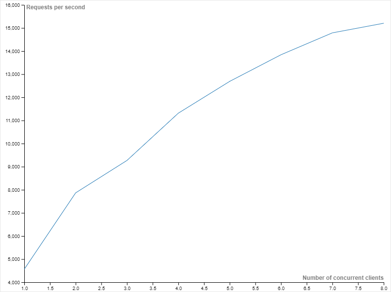
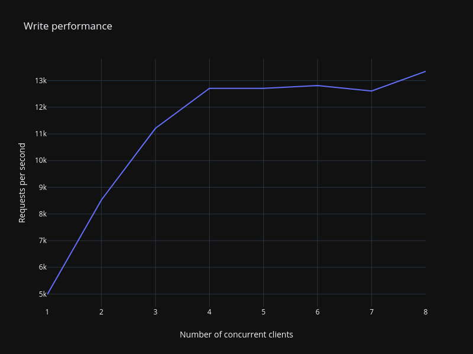

# NatanDB

A key-value (or more exactly key-array) standalone database written just for fun.

## Current state

Totally work-in-progress (doesn't event compile yet).

## Performance

### Read performance



| Concurrent clients | Num of operations | Performance | Std. dev |
|--------------------|-------------------|-------------|----------|
| 1                  | 10000             | 7708.5 rps  | 658.9    |
| 2                  | 10000             | 11967.4 rps | 974.0    |
| 3                  | 10000             | 17025.3 rps | 1471.0   |
| 4                  | 10000             | 20999.1 rps | 1877.5   |
| 5                  | 10000             | 25405.0 rps | 2120.7   |
| 6                  | 10000             | 29784.4 rps | 3255.0   |
| 7                  | 10000             | 33188.6 rps | 3223.1   |
| 8                  | 10000             | 35290.2 rps | 4140.1   |

Test protocol:

1. Start NatanDB server:

   ```shell
   rm -rf ./data && ./natandb run -d ./data
   ```

2. Run tests (in a separate terminal):

   ```shell
   for i in `seq 1 8`; do ./natandb test read -n 10000 -q -t $i $i; done
   ```

### Write performance



| Concurrent clients | Num of operations | Performance | Std. dev |
|--------------------|-------------------|-------------|----------|
| 1                  | 10000             | 4985.3 rps  | 181.9    |
| 2                  | 10000             | 8523.5 rps  | 622.5    |
| 3                  | 10000             | 11209.3 rps | 679.9    |
| 4                  | 10000             | 12707.9 rps | 973.0    |
| 5                  | 10000             | 12711.2 rps | 1066.9   |
| 6                  | 10000             | 12815.6 rps | 992.2    |
| 7                  | 10000             | 12609.9 rps | 1957.7   |
| 8                  | 10000             | 13344.6 rps | 878.0    |

Test protocol:

1. Start NatanDB server:

   ```shell
   rm -rf ./data && ./natandb run -d ./data
   ```

2. Run tests (in a separate terminal):

   ```shell
   for i in `seq 1 8`; do ./natandb test write -n 10000 -q -t $i $i; done
   ```

## License

[MIT](LICENSE)
